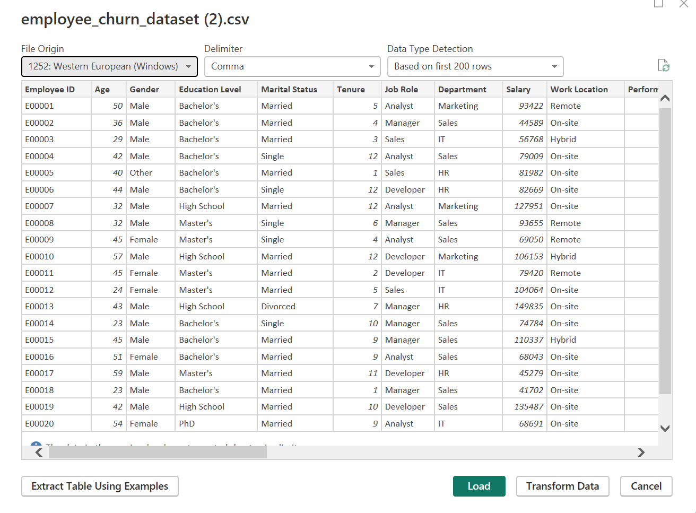
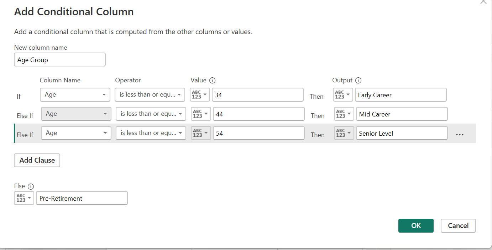
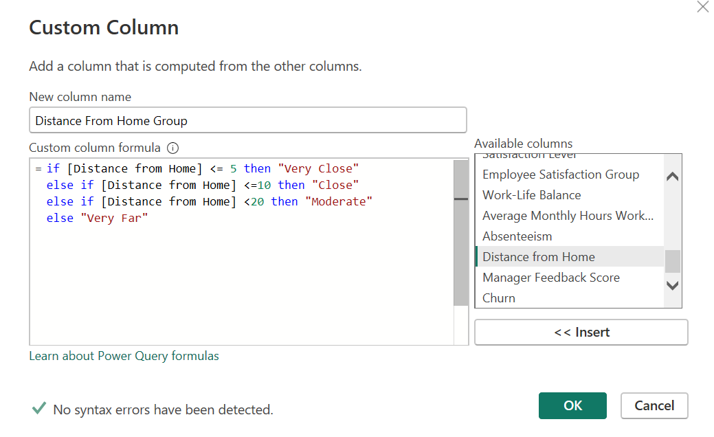
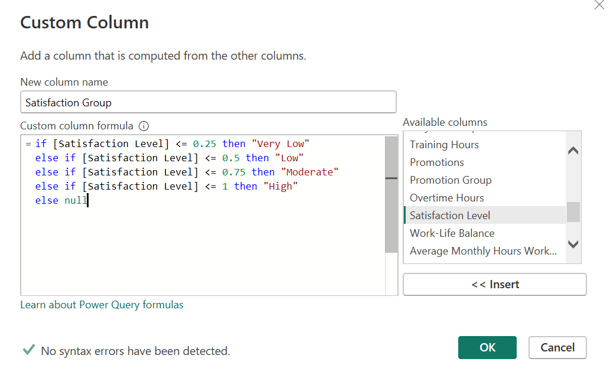
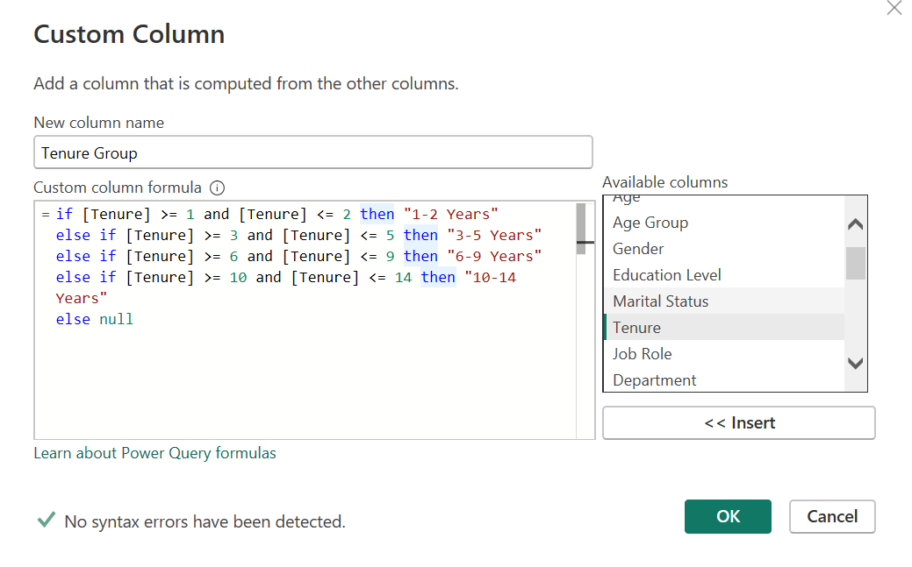
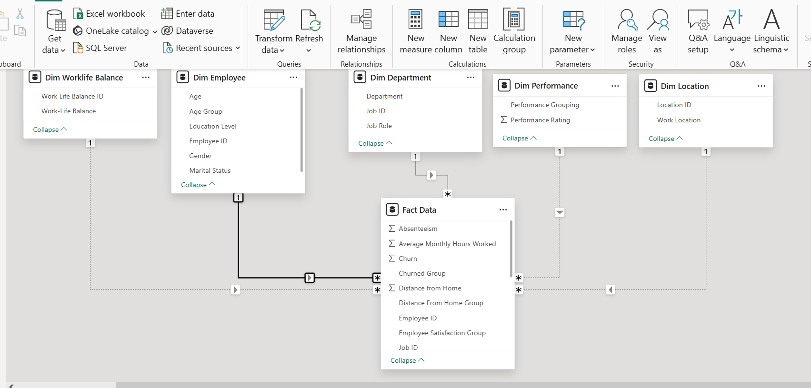
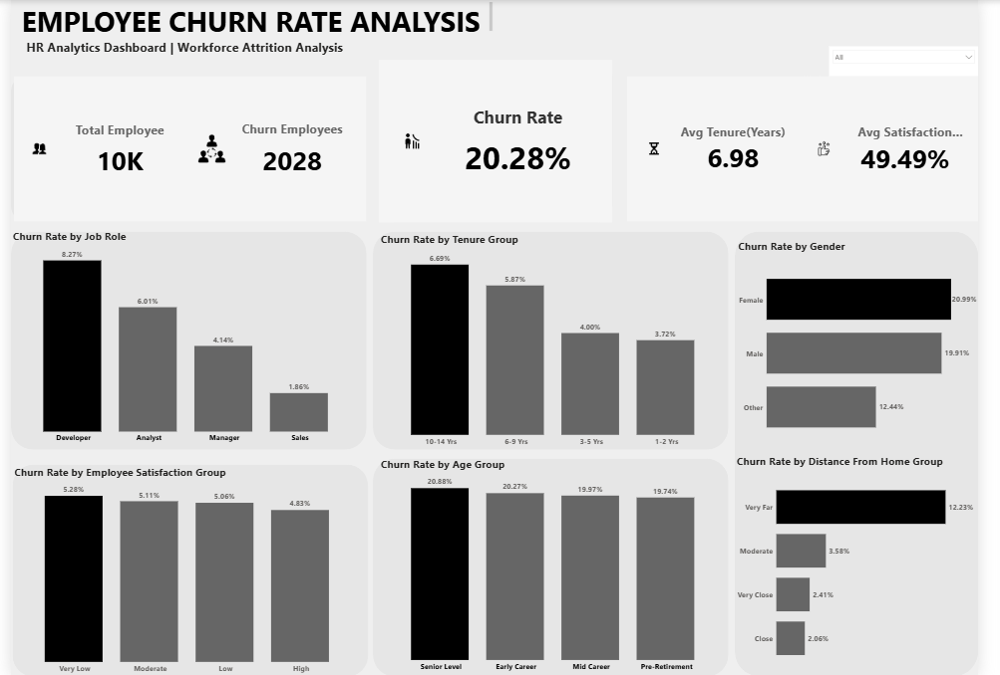

# Employee-Churn-Analysis-Dashboard
HR Analytics Dashboard built in Power BI analyzing employee churn patterns across job roles, tenure, satisfaction, and commute distance

## Introduction
Employee retention is a key challenge for organizations as high attrition can lead to increased recruitment costs, productivity loss, and reduced team stability. Understanding the factors that influence employee churn allows companies to make data-driven decisions to improve workforce engagement and retention.
This project focuses on analysing HR workforce data to identify patterns and trends related to employee attrition. Using Power BI, an interactive dashboard was created to explore churn behaviour across multiple workforce dimensions such as job roles, tenure groups, satisfaction levels, age groups, and distance from the workplace.
The objective of this analysis is to transform raw HR data into meaningful insights that help organizations better understand employee churn and identify potential risk areas

## Problem Statement
Employee attrition can negatively impact organizational performance, especially when high-performing or experienced employees leave the company. However, many organizations struggle to clearly identify the key drivers behind employee churn.
The business needs to understand which employee groups are most likely to leave and what factors may be contributing to higher attrition rates.
This analysis aims to answer key questions around:

- Which job roles experience the highest churn?
- Does employee tenure influence attrition?
- Are satisfaction levels linked to employee turnover?
- Does distance from home affect employee retention?
  
Understanding these patterns can help businesses develop better retention strategies and improve workforce stability.

## Data Sourcing
The dataset used in this project was sourced from a publicly available HR dataset used for analytics practice and portfolio projects.
The dataset contains workforce information for 10,000 employees, including demographic details, job roles, tenure, satisfaction levels, and other attributes related to employee behavior.
Key fields included in the dataset:
- Employee ID
- Job Role
- Gender
- Age Group
- Tenure Group
- Satisfaction Level
- Distance From Home
- Churn Status

## Data Transformation And Cleaning
Before analysis, the dataset was cleaned and transformed to ensure accuracy and usability.
The raw dataset was prepared by:
- Loading the data to power query
- Standardizing the column header for better readability
- Creating grouped fields such as Age groups, Tenure groups, Satisfaction categories and Distance From home groups
  
These steps ensured that the dataset was reliable and structured correctly for analysis in Power BI.

 

## Data Modelling (Power BI)
A data model was created in Power BI to support efficient analysis and dashboard performance.
The model was structured to support analytical queries and visual exploration of workforce data.
Key elements of the model include:

### Fact Table:
- Employee Workforce Data
### Dimension Fields:
- Employee
- Departments
- Performance
- Location
- Work Life Balance

## Analysis And Measures
Several key metrics and calculations were created to evaluate employee churn patterns.
Key measures created:

- Total Employees = DISTINCTCOUNT('Dim Employee'[Employee ID])
- Churn Employees = CALCULATE( DISTINCTCOUNT('Fact Data'[Employee ID]), 'FactData'[Churned Group] = "Left")
- Churn Rate =  DIVIDE([Total Churn Employee],[Total Employee])
- Average Tenure =  AVERAGE('Fact Data'[Tenure])
- Average Satisfaction Score = AVERAGE('Fact Data'[Satisfaction Level])

These measures help summarize workforce trends and allow comparison across different employee segments.
For example, the Churn Rate measure calculates the percentage of employees who left the company relative to the total workforce

## Dashboard And Visuals
The dashboard was designed to present HR insights in a clear and interactive format using Power BI.

Key components of the dashboard include:
- KPI Cards showing total employees, churn employees, churn rate, average tenure, and satisfaction
- Job role breakdown to identify which roles have the highest attrition
- Tenure group analysis to observe churn patterns across experience levels
- Gender distribution to examine demographic differences
- Satisfaction level comparison to explore potential engagement issues
- Distance from home analysis to evaluate the impact of commute on attrition
The dashboard allows users to quickly identify workforce risk areas and understand employee churn patterns across different segments.

## Insights And Findings
Several insights emerged from the analysis:
- Developers show the highest churn rate compared to other job roles.
- Employees with 10–14 years of tenure demonstrate the highest attrition levels.
- Employees living very far from the workplace experience higher churn rates.
- Lower satisfaction groups show slightly higher attrition compared to employees with higher satisfaction levels.
- Certain workforce segments show stronger churn patterns that may require targeted retention strategies

## Recommendations
Based on the findings from the data, The following actions could help reduce employee churn:
• Investigate workload, compensation, and career progression opportunities for high-risk job roles such as developers.
• Implement employee engagement initiatives to improve satisfaction levels across the workforce.
• Consider flexible work arrangements or remote work options for employees with long commuting distances.
• Develop retention strategies targeted at experienced employees within the 10–14 year tenure group.
These actions could help improve employee satisfaction and reduce overall attrition.

## Conclusion
This project provided a data-driven view of employee churn patterns using HR workforce data.
By analysing workforce segments such as job roles, tenure groups, satisfaction levels, and commute distance, the dashboard highlights key areas where employee attrition may occur.
The HR analytics dashboard enables organizations to explore workforce trends interactively and supports better decision-making around employee retention strategies

## Author
## Olatunbosun Fikayo
## Junior Data Analyst | Excel | SQL | Power BI
This project is part of my data analytics journey, where I document hands-on projects and share my insights publicly.
